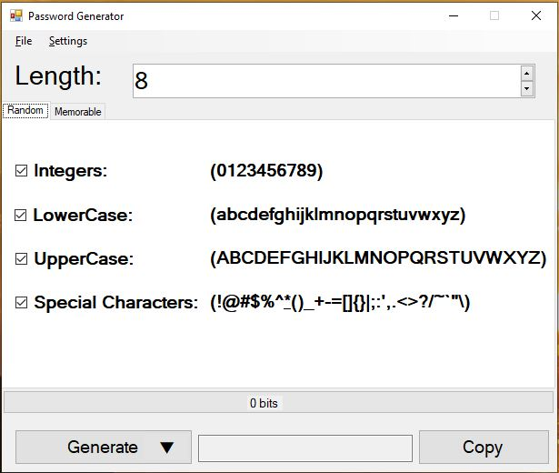
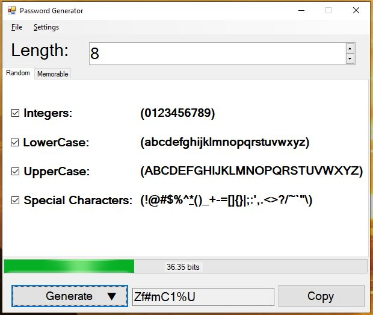
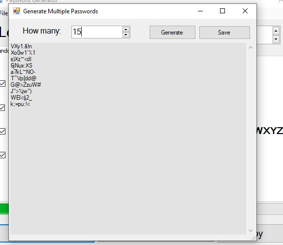

# Password Generator 🔑

Password Generator is a .NET Windows Forms desktop application inspired by Vovosoft Password Generator. It allows users to create secure passwords using different character combinations and memorable passwords based on a user-given keyword. The app also calculates password entropy and supports batch generation with the option to save passwords to a text file.

## Features 🌟
- **Customizable Password Generation**: Create passwords using:  
  - ✅ Integers (0-9)  
  - ✅ Special characters (!@#$%^&*...)  
  - ✅ Uppercase Letters (A-Z)
  - ✅ Lowercase Letters (a-z) 
- **Memorable Passwords**: Generate passwords using a keyword provided by the user.  
- **Entropy Calculation**: Analyze the strength of each generated password.  
- **Batch Password Generation**: Create multiple random or memorable passwords at once.  
- **Save Passwords to File**: Export generated passwords to a `.txt` file.  
- **Simple and Intuitive UI**: User-friendly Windows Forms interface.

---

## How to Use 📖
1. **Launch the Application**: Open the Password Generator app.  
2. **Select Password Options**: Choose the character types to include.  
3. **Set Length & Quantity**: Define the password length and how many to generate.  
4. **(Optional) Enter a Keyword**: For memorable passwords, provide a keyword.  
5. **Generate Password(s)**: Click "Generate" to create a password or batch of passwords.  
6. **View Entropy**: Check the entropy value to determine password strength.  
7. **Save to File**: Click "Save" to export passwords to a `.txt` file.  

---

## Live Demo 🔗
Try out the application by downloading it using the link below:  
[Download Password Generator](https://drive.google.com/file/d/1cIbyf-pi1KYEphzK858EX2mLtwEbPxYQ/view?usp=sharing)  

---

## Requirements 🛠️
- **.NET Framework**: Version 4.7.2 or higher  
- **Operating System**: Windows 7 or later  

---

## Installation 🖥️
1. Clone the repository:  
   ```bash
   git clone https://github.com/MarwanDev/PasswordGenerator.git


## Requirements 🛠️
- **.NET Framework**: Version 4.7.2 or higher  
- **Operating System**: Windows 7 or later  

## Installation 🖥️
1. Clone the repository:  
   ```bash
   git clone https://github.com/MarwanDev/PasswordGenerator.git

## Screenshots 🖼️
Take a look at the app in action:  

### Start
  

### Single Password  
  

### Multiple  



## Contributing 🤝
Contributions are welcome! Here's how you can help:  
1. Fork the repository.  
2. Create a feature branch (`git checkout -b feature-name`).  
3. Commit your changes (`git commit -m 'Add a new feature'`).  
4. Push to the branch (`git push origin feature-name`).  
5. Open a pull request.  

Feel free to open issues for bugs, suggestions, or enhancements.

## License 📜
This project is licensed under the [MIT License](LICENSE).  
